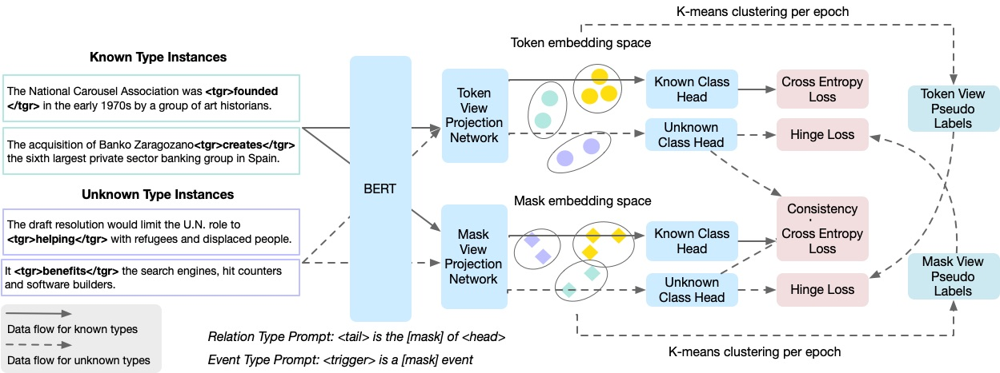

# Open Relation and Event Type Discovery with Type Abstraction

This is the official implementation of the paper published at EMNLP 2022.

## TL;DR



Type discovery is the task of identifying new relation/event types from unlabeled data. 

This task is more challenging than zero-shot learning since we don't even have access to type names.

Two ideas are important in making type discovery work: (1) transfer learning from known types (2) abstraction of type names. 

Having access to some known types helps the model learn "what is a relation/event". This is an idea that has been pursued by previous work like RSN and RoCORE.

Abstraction of type names works by trying to align the granularity of the type to some human concept. Even with a perfect metric space, only certain granularities make sense to humans.


## Requirements

```bash
pytorch=1.10.2
pytorch-lightning=1.5.10
torchmetrics=0.7.2
transformers=4.11.3
sklearn
numpy 
networkx 
python-louvain=0.16
pyyaml
wandb
```

## Datasets

- The TACRED dataset is available [here](https://nlp.stanford.edu/projects/tacred/). We used the original version of the TACRED dataset because we needed to resplit the dataset by relation types.
The model assumes that the data is organized in a `data/tacred` directory as follows:

```bash
|
|----train.json 
|----dev.json
|----test.json
|----relation_description.csv
```

This `relation_description.csv` file was adapted from RoCORE and we provide it under `data_sample/tacred`.

- The FewRel dataset is available [here](https://github.com/thunlp/FewRel). The directory `data/fewrel` should contain the following files:

```bash
|
|----train_wiki.json 
|----val_wiki.json
|----relation_description.csv
```

You can find the `relation_description.csv` file under `data_sample/fewrel/`.
These `relation_description.csv` files control which types are considered known and which are unknown. We keep them the same as RoCORE. However, in your experiments, you can play around with the relation type split.

- The ACE dataset is provided by LDC at (https://catalog.ldc.upenn.edu/LDC2006T06). We follow the preprocessing in OneIE which preserves multi-token trigger words.
The model assumes that the path has a prefix such as `pro_mttrig_id/json/train.oneie.json`. This might not be the case for your system, so please change the setting in `src/event_data_module.py` line 396 as neccesary. 
On the ACE dataset, we determine which types are known by sorting the types by frequency.

## Running the Model

The entry point of the model is `src/main.py`. Most of the hyperparameters are determined in `configs/`.
A sample script for running the model on TACRED is provided below. (Be sure to specify your checkpoint names, random seed and gpu id.)

Please change line 222 of `src/main.py` to your own project name and username if you would like to use Weights and Bias for model monitoring.

```bash
PRETRAIN_CKPT_NAME=<my pretrain checkpoint>
CKPT_NAME=<my checkpoint>
SEED=<my seed>
GPU=<gpu id>

if [ ! -d checkpoints/${PRETRAIN_CKPT_NAME} ]; then
    python src/main.py \
        --load_configs='configs/rel/tacred/pretrain.yaml' \
        --ckpt_name=${PRETRAIN_CKPT_NAME} \
        --psuedo_label="other" \
        --feature="all" \
        --seed=${SEED} \
        --gpus="${GPU},"


    echo "finished pretraining!"
fi


rm -rf checkpoints/${CKPT_NAME}
python src/main.py \
    --load_configs='configs/rel/tacred/train.yaml' \
    --ckpt_name=${CKPT_NAME} \
    --load_pretrained=checkpoints/${PRETRAIN_CKPT_NAME}/last.ckpt \
    --psuedo_label="other" \
    --feature="all" \
    --seed=${SEED} \
    --gpus="${GPU}," 

echo "finished model training!"


for ckpt_file in checkpoints/${CKPT_NAME}/epoch*.ckpt; do 
    echo "running test for ${ckpt_file}"
    python src/main.py \
        --load_configs='configs/rel/tacred/train.yaml' \
        --ckpt_name=${CKPT_NAME} \
        --load_ckpt=${ckpt_file} \
        --psuedo_label="other" \
        --feature="all" \
        --eval_only \
        --seed=${SEED} \
        --gpus="${GPU},"
    done 
```

Your checkpoint will be in a directory `checkpoints/<your checkpoint name>`. The `test_unknown_clusters.json` file will directly show you the results of each cluster and the `test_unknown_metrics.json` file will print out the metrics.

You can also run the baselines by changing the configuration path.

### Sanity checking

Due to the size of the datasets, randomness might be an issue.
On TACRED, getting an accuracy between 0.87-0.91 is considered normal.

